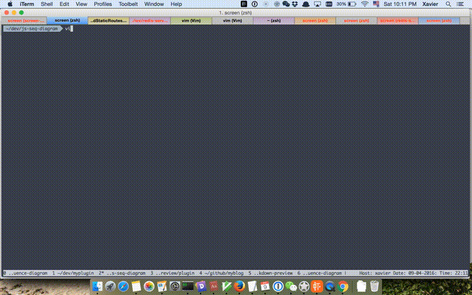

Vim Sequence-diagram Preview
====================

- [Intro](#intro)
- [Installation](#installation)
- [Usage](#usage)
- [License](#licnese)

Intro
-----
A Vim plugin for previewing sequence diagram in a browser. It's inspired by [vim-markdown-preview](https://github.com/JamshedVesuna/vim-markdown-preview)
and [JS Sequence Diagram](https://github.com/bramp/js-sequence-diagrams).

[JS Sequence Diagram](https://github.com/bramp/js-sequence-diagrams) is awesome! 
And its [online editing feature](https://bramp.github.io/js-sequence-diagrams/) is cool as well.
However, there're 2 drawbacks:

1. Online editing is opt to be lost, especially with an unexpected browser fresh or history-back.
2. You have to copy&paste between the online web page and your text editor repeatedly for updating/preview.

This vim plugin helps you handle the issues above, write your sequence diagram description in vim, press a hotkey to preview it in browser!


Installation
------------

* With [Pathogen](https://github.com/tpope/vim-pathogen): Place `vim-sequnce-diagram/` in `.vim/bundle/`.
* With [Vundle](https://github.com/VundleVim/Vundle.vim):
    * Add `Plugin 'xavierchow/vim-sequence-diagram'` to your `.vimrc`.
    * Launch `vim` and run `:PluginInstall`

Usage
-----
### File extension
This plugin only applies to files with `.seq` or `.sequence` file extension,
that means it has nearly no performance impact on other file types.

**Note:** Make sure you have renamed the file name with proper extension.

### Keymap for preview
The default keymap is `<leader>t`, it brings up a browser window and shows the sequence diagram for you.
You can also define your keymap in vimrc.
```
nmap <unique> <leader>t <Plug>GenerateDiagram 
```
### JS Sequence Diagram Theme
Currently there're mainly 2 themes with js-sequence-diagrams, `hand drawn` and `simple`.
You can add the following line into your vimrc for using `hand drawn` theme, set it to 0 or remove the line for `simple` theme.
```
let g:generate_diagram_theme_hand = 1
```
### Download as SVG or PNG
Use the buttons at the bottom to download the diagram as SVG or PNG.

License
-----------------

MIT

